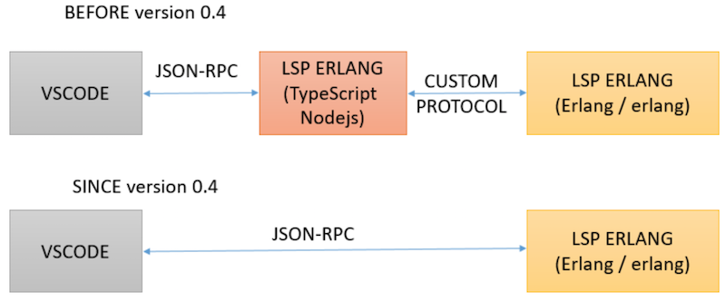
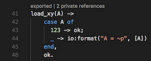
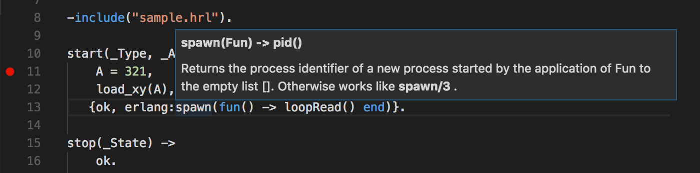
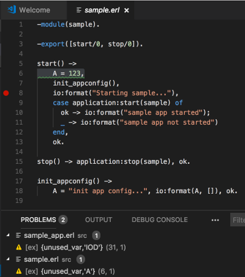

# Change log

## Version 0.4.1 (May 29, 2018)
### LSP fixes and improvements
* [PR #78](https://github.com/pgourlain/vscode_erlang/pull/78) 
	- Linter use defines from rebar.config
* [PR #79](https://github.com/pgourlain/vscode_erlang/pull/79) 
	- Fix Codelens when AutoSave is on
* [PR #80](https://github.com/pgourlain/vscode_erlang/pull/80) 
* [PR #81](https://github.com/pgourlain/vscode_erlang/pull/81) 
	- Improvement : LSP Error handling
* [PR #83](https://github.com/pgourlain/vscode_erlang/pull/83)
	- Issue #82 : filename:basedir() is not exist in OTP 18.0

Thanks to 
* [Wojtek Surowka](https://github.com/wojteksurowka)
---

## Version 0.4.0 (May 26, 2018)
### LSP purely in Erlang
* [PR #77](https://github.com/pgourlain/vscode_erlang/pull/77) 
	- Now Visual Studio Code communicate directly with Erlang over JSON-RPC
 

Thanks to 
* [Wojtek Surowka](https://github.com/wojteksurowka)
---

## Version 0.3.4 (May 21, 2018)
### Autocompletion for records and variables, LSP fixes
* [PR #73](https://github.com/pgourlain/vscode_erlang/pull/73) 
	- Project root used instead of rebar.config location
	- Include paths based on rebar.config location
	- Records autocompletion
	- Autocompletion for fields
	- Variables autocompletion

Thanks to 
* [Wojtek Surowka](https://github.com/wojteksurowka)
---

## Version 0.3.3 (May 20, 2018)
### Auto complete for exported functions
* [PR #71](https://github.com/pgourlain/vscode_erlang/pull/71) 
	- Autocomplete for exported functions	
	- includePaths may be relative to the project root

Thanks to 
* [Wojtek Surowka](https://github.com/wojteksurowka)
---

## Version 0.3.2 (May 16, 2018)
### LSP works without Auto Save and CodeLens fix
* [PR #66](https://github.com/pgourlain/vscode_erlang/pull/66) 
	- LSP works without Auto Save	
* [PR #67](https://github.com/pgourlain/vscode_erlang/pull/67) 
	- New setting includePaths added 
* [PR #68](https://github.com/pgourlain/vscode_erlang/pull/68) 
	- Fix CodeLens when Auto Save is off

Thanks to 
* [Wojtek Surowka](https://github.com/wojteksurowka)
---

## Version 0.3.1 (May 15, 2018)
### Auto indent and CodeLens fix
* [PR #64](https://github.com/pgourlain/vscode_erlang/pull/64) 
	- Fix on codeLens	
* [PR #65](https://github.com/pgourlain/vscode_erlang/pull/65) 
	- Auto indent

Thanks to 
* [Wojtek Surowka](https://github.com/wojteksurowka)
---

## Version 0.3.0 (May 12, 2018)
### LSP fixes and improvements  
* [PR #62](https://github.com/pgourlain/vscode_erlang/pull/62) 
	- Navigation works for records and fields
	- Navigation works for records in included files
* [PR #63](https://github.com/pgourlain/vscode_erlang/pull/63) 
	- Settings cleanup

Thanks to 
* [Wojtek Surowka](https://github.com/wojteksurowka)
---

## Version 0.2.9 (May 11, 2018)
### LSP  
* [PR #58](https://github.com/pgourlain/vscode_erlang/pull/58) 
	- Goto definition on module, hover info on BIF
* [PR #59](https://github.com/pgourlain/vscode_erlang/pull/59) 
	- Navigation works in all directories. Linter can find include files
	- Thanks to [Wojtek Surowka](https://github.com/wojteksurowka)
* [PR #60](https://github.com/pgourlain/vscode_erlang/pull/60) 
	- Update to the latest vscode LSP
* [PR #61](https://github.com/pgourlain/vscode_erlang/pull/61)
	- Add CodeLens support on functions
	- Add codelens configuration (erlang.languageServerProtocol.codeLensEnabled)

---

## Version 0.2.8 (May 9, 2018)
### LSP  
* [PR #55](https://github.com/pgourlain/vscode_erlang/pull/55)
	- LSP updates and README update
* [PR #56](https://github.com/pgourlain/vscode_erlang/pull/56) 
	- Hover shows edoc for project functions

Thanks to 
* [Wojtek Surowka](https://github.com/wojteksurowka)
---

## Version 0.2.7 (May 7, 2018)
### LSP and Debugger 
* [PR #53](https://github.com/pgourlain/vscode_erlang/pull/53)
	- Hover shows clause heads for project functions
* [PR #54](https://github.com/pgourlain/vscode_erlang/pull/54) 
	- Start Without Debugging no longer starts debugger

Thanks to 
* [Wojtek Surowka](https://github.com/wojteksurowka)
---

## Version 0.2.6 (May 2, 2018)
### LSP : Help hover for standard functions and some LSP fixes 
* [PR #52](https://github.com/pgourlain/vscode_erlang/pull/52) : Hover sample

Thanks to 
* [Wojtek Surowka](https://github.com/wojteksurowka)
---

## Version 0.2.5 (May 1, 2018)
### LSP Improvements 
* [PR #47](https://github.com/pgourlain/vscode_erlang/pull/49)
	- LSP Improvements (navigation and lint)
	
Thanks to 
* [Wojtek Surowka](https://github.com/wojteksurowka)
---

## Version 0.2.4 (April 29, 2018)
### LSP fixes 
* [PR #47](https://github.com/pgourlain/vscode_erlang/pull/47)
	- fix crash after remove epp error
* [PR #48](https://github.com/pgourlain/vscode_erlang/pull/48)
	- Go to Definition for function calls 
	
	
Thanks to 
* [Wojtek Surowka](https://github.com/wojteksurowka)
* [Shian](https://github.com/shian)
---

## Version 0.2.3 (April 21, 2018)
### LSP fixes 
* [PR #46](https://github.com/pgourlain/vscode_erlang/pull/46)
	- LSP fixes
	- README update
	
Thanks to [Wojtek Surowka](https://github.com/wojteksurowka)

---

## Version 0.2.2 (March 27, 2018)
### Debugging Fix and improvements 
* [PR #42](https://github.com/pgourlain/vscode_erlang/pull/43)
* [PR #43](https://github.com/pgourlain/vscode_erlang/pull/44)
* [PR #45](https://github.com/pgourlain/vscode_erlang/pull/45)
	- Conditional breakpoints
	- Warnings recognised by problemMatcher
	- Minor changes
	
Thanks to [Wojtek Surowka](https://github.com/wojteksurowka)

---

## Version 0.2.1 (March 24, 2018)
### Debugging Fix and improvements 
* [PR #42](https://github.com/pgourlain/vscode_erlang/pull/42)
	- Step Out support
	- Pause support
	- Call stack shows function names with arity
	- Other minor improvements and bug fixes

Thanks to [Wojtek Surowka](https://github.com/wojteksurowka)

---

## Version 0.2.0 (March 17, 2018)
### Debugging Fix and improvements 
- [PR #37](https://github.com/pgourlain/vscode_erlang/pull/37), [PR #39](https://github.com/pgourlain/vscode_erlang/pull/39), [PR #40](https://github.com/pgourlain/vscode_erlang/pull/40)

Thanks to [Wojtek Surowka](https://github.com/wojteksurowka)

## Previous versions
* 0.1.9 Linter fix : (disable epp warnings)
* 0.1.8 First preview of Validation/Format document
	- 
		- Today, you should activate 'Auto save' in the 'File' menu of VSCode. Due that only the filename of document is send to the Erlang LSP server (LSP: Language Server Protocol)
		- technical traces can be activated by configuration (set  "erlang.LanguageServerProtocol.verbose" : "true" in your settings file) 
	- Console quiet by default (https://github.com/wojteksurowka) -> [PR #29](https://github.com/pgourlain/vscode_erlang/pull/29)
	- Start Without Debugging support (https://github.com/wojteksurowka) -> [PR #28](https://github.com/pgourlain/vscode_erlang/pull/28) 
* 0.1.7 Fix missing file
* 0.1.6 Fixes for process management during debugging ([wojteksurowka](https://github.com/wojteksurowka) -> [PR #25,#26,#27](https://github.com/pgourlain/vscode_erlang/pull/27))
	- correct file opened from stack without release) structure
	- Fix for processes monitoring
	- do not output waiting status to console
* 0.1.5 debug experience improvements, bug fixes, clear code ([Andrew Sumskoy](https://github.com/andrewsumskoy) -> [PR #23](https://github.com/pgourlain/vscode_erlang/pull/23))
	- variable view tree support for list, map, tuple
	- watch expression support
	- erlang rewrite json serialization and cleanup
	- bug fix: with remove last breakpoint
	- bug fix: runtime set breakpoint in different module
	- bug fix: on break event vscode show file in _build/default/lib/*/src/* not in apps/*/src
* 0.1.4
	- Fix args json escape format, add variable type basic support (#22)
* 0.1.3
	- user can provide configuration settings to the build command (#19)
* 0.1.2
	- fix rebar3 #4
* 0.1.1
	- fix debugger integration #15
* 0.1.0
	- debugger integration
* 0.0.9
	- fix shortcuts (ctrl-shift-B, ctrl-shift-T)
* 0.0.8
	- Add debugger adapter  
* 0.0.7
	- Fix assertXXXX expected/value for vscode.diagnostic 
* 0.0.6
	- Fix 'rebar' spawning on windows
* 0.0.5
	- Add eunit run command without rebar (use an erlang shell)