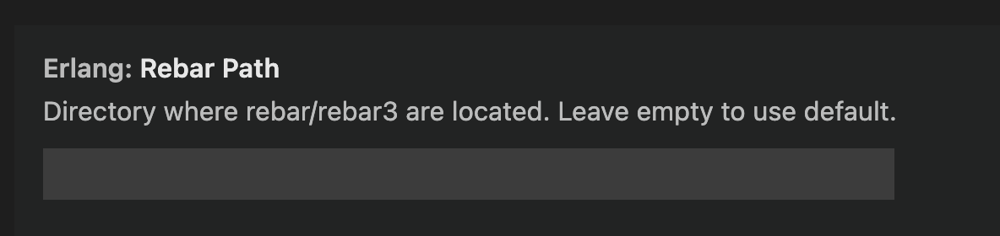

# Change log

## Version 0.8.9 (May 2, 2023)

* [253](https://github.com/pgourlain/vscode_erlang/issues/253) : 
  - Dialyzer shows status bar messages and add found issues to Problems pane
  - Not standard behaviours/parse transforms are now compiled with the correct include paths

Thanks to
* [Wojtek Surowka](https://github.com/wojteksurowka)

---

## Version 0.8.8 (April 4, 2023)

* [252](https://github.com/pgourlain/vscode_erlang/issues/252)  : Fixes and improvements 
  - Extension output is no longer opened automatically : fix [230](https://github.com/pgourlain/vscode_erlang/issues/230)
  - Improvements in behaviours support
  - Indent works for begin and [maybe](https://www.erlang.org/doc/reference_manual/expressions.html#maybe)
  - Hover help always on if available in Erlang distribution
    - erlang.eep48Help configuration section is removed

Thanks to
* [Wojtek Surowka](https://github.com/wojteksurowka)

---

## Version 0.8.7 (March 26, 2023)

* [247](https://github.com/pgourlain/vscode_erlang/issues/247)  : Revert #232, Back to double binary closing pairs.

---

## Version 0.8.6 (August 11, 2022)

* [237](https://github.com/pgourlain/vscode_erlang/issues/237) : Use rebar3 path from Settings
  - by default embbeded rebar is working only for OTP 24 and after. So to use oldest rebar3, set "Rebar path settings"
  

---

## Version 0.8.5 (August 9, 2022)

* [227](https://github.com/pgourlain/vscode_erlang/issues/227) : Bug fixes on previous 223/225/226 PRs
* [232](https://github.com/pgourlain/vscode_erlang/issues/232) : Use single binary closing pair
* [235](https://github.com/pgourlain/vscode_erlang/issues/235) : rebar3 upgrade

Thanks to
* [Wojtek Surowka](https://github.com/wojteksurowka)
* [William Fank Thomé](https://github.com/williamthome)

---

## Version 0.8.4 (February 3, 2022)
* [223](https://github.com/pgourlain/vscode_erlang/issues/223) : Formating a *.erl file will cause error
* [225](https://github.com/pgourlain/vscode_erlang/issues/225) : go to function definition stopped working
* [226](https://github.com/pgourlain/vscode_erlang/issues/226) : lsp_handlers.erl:160: function formatting/1 undefined

Thanks to
* [Wojtek Surowka](https://github.com/wojteksurowka)

---

## Version 0.8.3 (January 2, 2022)
* [224](https://github.com/pgourlain/vscode_erlang/issues/224) : Formatting uses erlfmt, some fixes
  - erlfmt used for document formatting
  - Debugger hover was not working for S in <<A:S

Thanks to
* [Wojtek Surowka](https://github.com/wojteksurowka)

---

## Version 0.8.2 (November 28, 2021)
* [222](https://github.com/pgourlain/vscode_erlang/issues/222) : Remove erlang.org help support

Thanks to
* [Wojtek Surowka](https://github.com/wojteksurowka)

---

## Version 0.8.1 (October 2, 2021)
* [218](https://github.com/pgourlain/vscode_erlang/issues/218) : Bump submodule 'grammar' to the latest version
* [219](https://github.com/pgourlain/vscode_erlang/issues/219) : FIX: unused functions of names < 5 chars caused syntax checker crash

Thanks to
* [Kornel H](https://github.com/KornelH)
* [Wojtek Surowka](https://github.com/wojteksurowka)

## Version 0.8.0 (September 8, 2021)
* [207](https://github.com/pgourlain/vscode_erlang/issues/207) : The debugger supports log breakpoints

Thanks to
* [Wojtek Surowka](https://github.com/wojteksurowka)

## Version 0.7.9 (September 4, 2021)
* [215](https://github.com/pgourlain/vscode_erlang/issues/215) : Fix autocomplete and hover

Thanks to
* [Wojtek Surowka](https://github.com/wojteksurowka)
* [Sergei Shuvatov](https://github.com/Yozhig)

## Version 0.7.8 (August 22, 2021)
* [209](https://github.com/pgourlain/vscode_erlang/issues/209) : Fix parsing record match spec and go to record
* [210](https://github.com/pgourlain/vscode_erlang/issues/210) : Fix can't jump in some cases when func in tuple
* [212](https://github.com/pgourlain/vscode_erlang/issues/212) : Add files from _build directory to end of project modules lists
Thanks to
* [Kornel H](https://github.com/KornelH)
* [shuying2244](https://github.com/shuying2244)
* [Sergei Shuvatov](https://github.com/Yozhig)

## Version 0.7.7 (May 17, 2021)
 * [#205](https://github.com/pgourlain/vscode_erlang/issues/205) : Fix handling of UNC paths on Windows
 * [#203](https://github.com/pgourlain/vscode_erlang/pull/203) : Optimize the jump experience
Thanks to
* [Chi Lambda](https://github.com/chi-lambda)
* [shuying2244](https://github.com/shuying2244)

## Version 0.7.6 (April 26, 2021)
 * [#202](https://github.com/pgourlain/vscode_erlang/issues/202) : OTP 24 compatibility

Thanks to
* [Wojtek Surowka](https://github.com/wojteksurowka)

## Version 0.7.5 (April 21, 2021)
* Fix debugger launch

## Version 0.7.4 (April 20, 2021)
* Fix casing file erlang.plist

## Version 0.7.3 (April 19, 2021)
 * [#200](https://github.com/pgourlain/vscode_erlang/issues/200) : Use webpack to build extension
 * [#199](https://github.com/pgourlain/vscode_erlang/issues/199) : Add unit tests ossature and navigation unit tests. see DevelopersReadme.md for more details

## Version 0.7.2 (April 11, 2021)
 * Quick fix on unhandled case in goto definition feature

## Version 0.7.1 (April 10, 2021)
* [#189](https://github.com/pgourlain/vscode_erlang/issues/189) : Hope goto definition support for record item.
* [#146](https://github.com/pgourlain/vscode_erlang/issues/146) : Goto definition doesn't work from the export directive.
* [#120](https://github.com/pgourlain/vscode_erlang/issues/120) : Support goto definition for Macro.
* [#191](https://github.com/pgourlain/vscode_erlang/issues/191) : Goto definition on include and include_lib
* [#193](https://github.com/pgourlain/vscode_erlang/issues/193) : Support goto definition, on tuple, and so on..

Thanks to
* [shuying2244](https://github.com/shuying2244)

## Version 0.7.0 (March 6, 2021)
* [#184](https://github.com/pgourlain/vscode_erlang/issues/188) :  Fix improper list handling on debugger mapping.

Thanks to
* [Zsolt Laky](https://github.com/zsoci)

## Version 0.6.9 (January 25, 2021)
* [#184](https://github.com/pgourlain/vscode_erlang/issues/184) : Spaces Are Not Escaped in the Path to Rebar3. On Windows, we must use double quotes instead of
single quotes.

Thanks to
* [WHemanth V. Alluri](https://github.com/Hypro999)

## Version 0.6.8 (January 24, 2021)
* [#182](https://github.com/pgourlain/vscode_erlang/issues/182) : Spaces Are Not Escaped in the Path to Rebar3 .

## Version 0.6.7 (December 20, 2020)
* [#178](https://github.com/pgourlain/vscode_erlang/issues/178) : Finds exports and macros definitions. Bug fix in Help. Settings texts improved.
* [#178](https://github.com/pgourlain/vscode_erlang/issues/179) : Dot optional in Debug Console.

Thanks to
* [Wojtek Surowka](https://github.com/wojteksurowka)

## Version 0.6.6 (December 5, 2020)
* Fix [#174](https://github.com/pgourlain/vscode_erlang/issues/174) : Improve syntax highlight
* Fix [#177](https://github.com/pgourlain/vscode_erlang/issues/177) : Custom behaviours improvement 

Thanks to
* [Kornel H](https://github.com/sebkm)
* [Wojtek Surowka](https://github.com/wojteksurowka)

## Version 0.6.5 (July 26, 2020)
* Allow to goto definition in erlang lib
* Use help from new feature from OTP 23 (EEP-48)[https://erlang.org/doc/apps/kernel/eep48_chapter.html]

## Version 0.6.4 (July 13, 2020)

* Fix [#146](https://github.com/pgourlain/vscode_erlang/issues/146) : Go to definition doesn't work from the export directive
* Fix [#138](https://github.com/pgourlain/vscode_erlang/issues/138) : Add support of parse_transform on syntax tree if present in compile attribute
* Fix [#140](https://github.com/pgourlain/vscode_erlang/issues/140) : breakpoints set in non erlang files are exclude on startup
* Fix [#106](https://github.com/pgourlain/vscode_erlang/issues/106) : exclude function that endswith "_test" in warnings
* Fix [#148](https://github.com/pgourlain/vscode_erlang/issues/148) : Add rebar plugins path in includepaths to resolve include_lib
* Migrate to vscode engine 1.46
* Add 'inline' DebuggerMode in config
* Add help.md link in readme.md that provide some tricks about erlang extension configuration.

## Version 0.6.3 (June 22, 2020)

* Fix #162 : run without debugging failed

## Version 0.6.2 (June 20, 2020)

* The debuggerAdapter (link between vscode and erlang in debug), can be hosted in two modes (server, external)
  * see configuration : erlang.debuggerRunMode
* [PR #159](https://github.com/pgourlain/vscode_erlang/pull/159) : Adding support for %%region / %%endregion folding
* [PR #135](https://github.com/pgourlain/vscode_erlang/pull/135) : Supervisor snippet & fix 
* [PR #141](https://github.com/pgourlain/vscode_erlang/pull/141) : Adding *.es file association
* [PR #154](https://github.com/pgourlain/vscode_erlang/pull/154) : Merging 0.6.0, 0.6.1 from [KornelH repo](https://github.com/KornelH/vscode_erlang)
  * Improve auto indentation:
    * Continue comments if break line in the middle except module documentation
      (triple `%`) that always continue
    * Half-indent guards
    * Indent after clause starts, inside tuples, list and parameter lists
    * Outdent after clause ends
  * Fix syntax highlight:
    * Allow comment between '}' and ').' in record definitions
    * Allow variables as module or function names in implicit function
      expressions
    * Distinguish function type in type specification and explicit function
      expression
  * Setting `erlang.erlangPath` now can accept workspace relative path
  * Respect setting `search.exclude` when looking for the source file of an erlang
    module. With this setting source files duplicated by build system can be
    excluded from for example "Go to definition" and other code navigation.

  * Use updates from [Daniel Finke](https://github.com/danielfinke)'s
  [vscode_erlang](https://github.com/danielfinke/vscode_erlang) repository:

  * Remove Erlang binaries and compile Erlang counterpart of the extension
    on-the-fly at the first usage per Visual Studio Code instance
  * Fix syntax highlight: comma is not needed in `-define` on the same line as
    macro name
  * Remove `pgoconsoloe` and use `erlang` output channel only

Thanks to

* [Daniel Finke](https://github.com/danielfinke)
* [Kornel H](https://github.com/KornelH)
* [Emmanuel Boutin](https://github.com/eboutin)
* [Serge Aleynikov](https://github.com/saleyn)
* [Andrei Dziaineka](https://github.com/dziaineka)

## Version 0.5.2 (March 2, 2019)

### Bug fix

* [PR #129](https://github.com/pgourlain/vscode_erlang/pull/129)
  Fix completion #128 & #129

---

## Version 0.5.1 (February 26, 2019)

### Bug fix

* [PR #123](https://github.com/pgourlain/vscode_erlang/pull/123)
  Fix accidental reassignment of eunitCommand
* [PR #125](https://github.com/pgourlain/vscode_erlang/pull/125)
  Fix erlangPath setting for Linux/OSX
* [PR #126](https://github.com/pgourlain/vscode_erlang/pull/126)
  Fix includes for linting of test files

Thanks to

* [Benedikt Reinartz](https://github.com/filmor)
* [Nigel Rook](https://github.com/NigelRook)

---

## Version 0.5.0 (November 17, 2018)

### Improvements

* [PR #118](https://github.com/pgourlain/vscode_erlang/pull/117)
  Behaviours not from standard library recognised by linter

Thanks to

* [Wojtek Surowka](https://github.com/wojteksurowka)

---

## Version 0.4.9 (November 11, 2018)

### Bug fix

* [PR #117](https://github.com/pgourlain/vscode_erlang/pull/117)
  Debugger comm no longer crashes if tuple is used as a key in a map

Thanks to

* [Wojtek Surowka](https://github.com/wojteksurowka)

---

## Version 0.4.8 (November 5, 2018)

### Bug fix

* [PR #116](https://github.com/pgourlain/vscode_erlang/pull/116)
  Proxy setting support
* [PR #115](https://github.com/pgourlain/vscode_erlang/pull/115)
  Call timeout on gen_lsp_doc_server

---

## Version 0.4.7 (November 3, 2018)

### New features

* [PR #103](https://github.com/pgourlain/vscode_erlang/pull/103)
  Support for .xrl (leex) extension
* [PR #113](https://github.com/pgourlain/vscode_erlang/pull/113)
  Add symbol provider. Now outline view is filled with functions, types and records.

Thanks to

* [Jon Parise](https://github.com/jparise)

---

## Version 0.4.6 (June 20, 2018)

### Bug fix

* [PR #99](https://github.com/pgourlain/vscode_erlang/pull/99)
  Format Document fixes

Thanks to

* [Wojtek Surowka](https://github.com/wojteksurowka)

---

## Version 0.4.5 (June 16, 2018)

### Autocompletion improvements and bug fixes

* [PR #96](https://github.com/pgourlain/vscode_erlang/pull/96)
  Autocompletion fixes and improvements
* [PR #98](https://github.com/pgourlain/vscode_erlang/pull/98)
  Using 'erlangPath' configuration everywhere

Thanks to

* [Wojtek Surowka](https://github.com/wojteksurowka)

---

## Version 0.4.4 (June 8, 2018)

### Autocompletion improvements

* [PR #92](https://github.com/pgourlain/vscode_erlang/pull/92)
  Autocomplete for atoms
* [PR #93](https://github.com/pgourlain/vscode_erlang/pull/93)
  Autocompletion improvements

Thanks to

* [Wojtek Surowka](https://github.com/wojteksurowka)

---

## Version 0.4.3 (June 1, 2018)

### Dialyzer support and Linter fix

* [PR #87](https://github.com/pgourlain/vscode_erlang/pull/87)
  Add Dialyzer support
* [PR #88](https://github.com/pgourlain/vscode_erlang/pull/88)
  Fix linter include paths when the recommended Erlang structure is used.

Thanks to

* [Wojtek Surowka](https://github.com/wojteksurowka)
* [Nigel Rook](https://github.com/NigelRook)

---

## Version 0.4.2 (May 29, 2018)

### Fix #84, #85

* [PR #86](https://github.com/pgourlain/vscode_erlang/pull/86)
  Fix #84 and #85

---

## Version 0.4.1 (May 29, 2018)

### LSP fixes and improvements

* [PR #78](https://github.com/pgourlain/vscode_erlang/pull/78)
  Linter use defines from rebar.config
* [PR #79](https://github.com/pgourlain/vscode_erlang/pull/79)
  Fix Codelens when AutoSave is on
* [PR #80](https://github.com/pgourlain/vscode_erlang/pull/80)
* [PR #81](https://github.com/pgourlain/vscode_erlang/pull/81)
  Improvement : LSP Error handling
* [PR #83](https://github.com/pgourlain/vscode_erlang/pull/83)
  filename:basedir() is not exist in OTP 18.0

Thanks to

* [Wojtek Surowka](https://github.com/wojteksurowka)

---

## Version 0.4.0 (May 26, 2018)

### LSP purely in Erlang

* [PR #77](https://github.com/pgourlain/vscode_erlang/pull/77)
  Now Visual Studio Code communicate directly with Erlang over JSON-RPC
  

Thanks to

* [Wojtek Surowka](https://github.com/wojteksurowka)

---

## Version 0.3.4 (May 21, 2018)

### Autocompletion for records and variables, LSP fixes

* [PR #73](https://github.com/pgourlain/vscode_erlang/pull/73)
  * Project root used instead of rebar.config location
  * Include paths based on rebar.config location
  * Records autocompletion
  * Autocompletion for fields
  * Variables autocompletion

Thanks to

* [Wojtek Surowka](https://github.com/wojteksurowka)

---

## Version 0.3.3 (May 20, 2018)

### Auto complete for exported functions

* [PR #71](https://github.com/pgourlain/vscode_erlang/pull/71)
  * Autocomplete for exported functions
  * includePaths may be relative to the project root

Thanks to

* [Wojtek Surowka](https://github.com/wojteksurowka)

---

## Version 0.3.2 (May 16, 2018)

### LSP works without Auto Save and CodeLens fix

* [PR #66](https://github.com/pgourlain/vscode_erlang/pull/66)
  LSP works without Auto Save
* [PR #67](https://github.com/pgourlain/vscode_erlang/pull/67)
  New setting includePaths added
* [PR #68](https://github.com/pgourlain/vscode_erlang/pull/68)
  Fix CodeLens when Auto Save is off

Thanks to

* [Wojtek Surowka](https://github.com/wojteksurowka)

---

## Version 0.3.1 (May 15, 2018)

### Auto indent and CodeLens fix

* [PR #64](https://github.com/pgourlain/vscode_erlang/pull/64)
  Fix on codeLens
* [PR #65](https://github.com/pgourlain/vscode_erlang/pull/65)
  Auto indent

Thanks to

* [Wojtek Surowka](https://github.com/wojteksurowka)

---

## Version 0.3.0 (May 12, 2018)

### LSP fixes and improvements

* [PR #62](https://github.com/pgourlain/vscode_erlang/pull/62)
  * Navigation works for records and fields
  * Navigation works for records in included files
* [PR #63](https://github.com/pgourlain/vscode_erlang/pull/63)
  Settings cleanup

Thanks to

* [Wojtek Surowka](https://github.com/wojteksurowka)

---

## Version 0.2.9 (May 11, 2018)

### LSP

* [PR #58](https://github.com/pgourlain/vscode_erlang/pull/58)
  Goto definition on module, hover info on BIF
* [PR #59](https://github.com/pgourlain/vscode_erlang/pull/59)
  * Navigation works in all directories. Linter can find include files
  * Thanks to [Wojtek Surowka](https://github.com/wojteksurowka)
* [PR #60](https://github.com/pgourlain/vscode_erlang/pull/60)
  Update to the latest vscode LSP
* [PR #61](https://github.com/pgourlain/vscode_erlang/pull/61)
  * Add CodeLens support on functions
  * Add codelens configuration (erlang.languageServerProtocol.codeLensEnabled)
    

---

## Version 0.2.8 (May 9, 2018)

### LSP

* [PR #55](https://github.com/pgourlain/vscode_erlang/pull/55)
  LSP updates and README update
* [PR #56](https://github.com/pgourlain/vscode_erlang/pull/56)
  Hover shows edoc for project functions

Thanks to

* [Wojtek Surowka](https://github.com/wojteksurowka)

---

## Version 0.2.7 (May 7, 2018)

### LSP and Debugger

* [PR #53](https://github.com/pgourlain/vscode_erlang/pull/53)
  Hover shows clause heads for project functions
* [PR #54](https://github.com/pgourlain/vscode_erlang/pull/54)
  Start Without Debugging no longer starts debugger

Thanks to

* [Wojtek Surowka](https://github.com/wojteksurowka)

---

## Version 0.2.6 (May 2, 2018)

### LSP : Help hover for standard functions and some LSP fixes

* [PR #52](https://github.com/pgourlain/vscode_erlang/pull/52) Hover sample
  

Thanks to

* [Wojtek Surowka](https://github.com/wojteksurowka)

---

## Version 0.2.5 (May 1, 2018)

### LSP Improvements

* [PR #47](https://github.com/pgourlain/vscode_erlang/pull/49)
  LSP Improvements (navigation and lint)

Thanks to

* [Wojtek Surowka](https://github.com/wojteksurowka)

---

## Version 0.2.4 (April 29, 2018)

### LSP fixes

* [PR #47](https://github.com/pgourlain/vscode_erlang/pull/47)
  Fix crash after remove epp error
* [PR #48](https://github.com/pgourlain/vscode_erlang/pull/48)
  Go to Definition for function calls

Thanks to

* [Wojtek Surowka](https://github.com/wojteksurowka)
* [Shian](https://github.com/shian)

---

## Version 0.2.3 (April 21, 2018)

### LSP fixes

* [PR #46](https://github.com/pgourlain/vscode_erlang/pull/46)
  * LSP fixes
  * README update

Thanks to [Wojtek Surowka](https://github.com/wojteksurowka)

---

## Version 0.2.2 (March 27, 2018)

### Debugging Fix and improvements

* [PR #42](https://github.com/pgourlain/vscode_erlang/pull/43)
* [PR #43](https://github.com/pgourlain/vscode_erlang/pull/44)
* [PR #45](https://github.com/pgourlain/vscode_erlang/pull/45)
  * Conditional breakpoints
  * Warnings recognised by problemMatcher
  * Minor changes

Thanks to [Wojtek Surowka](https://github.com/wojteksurowka)

---

## Version 0.2.1 (March 24, 2018)

### Debugging Fix and improvements

* [PR #42](https://github.com/pgourlain/vscode_erlang/pull/42)
  * Step Out support
  * Pause support
  * Call stack shows function names with arity
  * Other minor improvements and bug fixes

Thanks to [Wojtek Surowka](https://github.com/wojteksurowka)

---

## Version 0.2.0 (March 17, 2018)

### Debugging Fix and improvements

* [PR #37](https://github.com/pgourlain/vscode_erlang/pull/37),
  [PR #39](https://github.com/pgourlain/vscode_erlang/pull/39),
  [PR #40](https://github.com/pgourlain/vscode_erlang/pull/40)

Thanks to [Wojtek Surowka](https://github.com/wojteksurowka)

## Previous versions

* 0.1.9 Linter fix : (disable epp warnings)
* 0.1.8 First preview of Validation/Format document
  * 
    * Today, you should activate 'Auto save' in the 'File' menu of VSCode.
      Due that only the filename of document is send to the Erlang LSP server
      (LSP: Language Server Protocol)
    * Technical traces can be activated by configuration (set
      "erlang.LanguageServerProtocol.verbose" : "true" in your settings file)
  * Console quiet by default (<https://github.com/wojteksurowka>) ->
    [PR #29](https://github.com/pgourlain/vscode_erlang/pull/29)
  * Start Without Debugging support (<https://github.com/wojteksurowka>) ->
    [PR #28](https://github.com/pgourlain/vscode_erlang/pull/28)
* 0.1.7 Fix missing file
* 0.1.6 Fixes for process management during debugging ([wojteksurowka](https://github.com/wojteksurowka) -> [PR #25,#26,#27](https://github.com/pgourlain/vscode_erlang/pull/27))
  * Correct file opened from stack without release) structure
  * Fix for processes monitoring
  * Do not output waiting status to console
* 0.1.5 debug experience improvements, bug fixes, clear code ([Andrew Sumskoy](https://github.com/andrewsumskoy) -> [PR #23](https://github.com/pgourlain/vscode_erlang/pull/23))
  * variable view tree support for list, map, tuple
  * watch expression support
  * erlang rewrite json serialization and cleanup
  * bug fix: with remove last breakpoint
  * bug fix: runtime set breakpoint in different module
  * bug fix: on break event vscode show file in _build/default/lib/*/src/* not in apps/*/src
* 0.1.4
  * Fix args json escape format, add variable type basic support (#22)
* 0.1.3
  * user can provide configuration settings to the build command (#19)
* 0.1.2
  * fix rebar3 #4
* 0.1.1
  * fix debugger integration #15
* 0.1.0
  * debugger integration
* 0.0.9
  * fix shortcuts (ctrl-shift-B, ctrl-shift-T)
* 0.0.8
  * Add debugger adapter
* 0.0.7
  * Fix assertXXXX expected/value for vscode.diagnostic
* 0.0.6
  * Fix 'rebar' spawning on windows
* 0.0.5
  * Add eunit run command without rebar (use an erlang shell)
