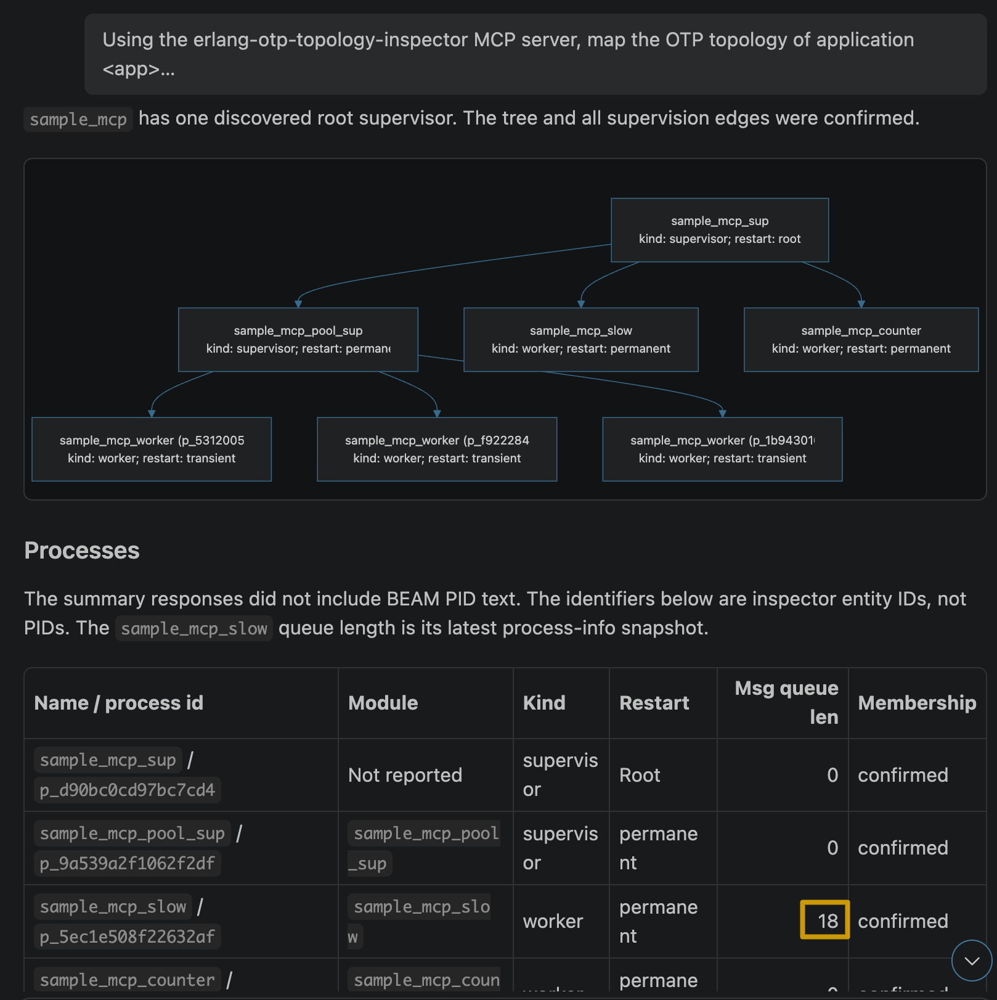

# Help & Troubleshooting

Symptoms, causes and fixes for the Erlang extension. Find your symptom below;
if none matches, see [Reporting a bug](#reporting-a-bug).

## First, check this

Three commands answer most questions (`Ctrl+Shift+P` / `Cmd+Shift+P`):

- **`Erlang: Check Erlang/OTP and rebar3 installation`** - shows which `erl` and
  which `rebar3` the extension actually uses.
- **`Erlang: Show Language Server Output`** - the server's log. Set
  `"erlang.verbose": true` for technical traces (noisy methods are filtered by
  `erlang.verboseExcludeFilter`).
- **`Erlang: Restart Language Server`** - after changing a path setting or
  installing another OTP version.

The status bar shows the language server state and the OTP version it runs on.

## Nothing works: no completion, no errors, no navigation

The language server did not start. Run `Erlang: Check Erlang/OTP and rebar3
installation`, then open the output channel.

`erl` not found: set `erlang.erlangPath` to the **directory** holding
`erl`/`escript`, not to the binary:

```json
{
    "erlang.erlangPath": "/home/me/.asdf/installs/erlang/27.2/bin"
}
```

`${workspaceFolder}` is substituted in `erlang.erlangPath` and
`erlang.rebarPath` (only in those two settings).

rebar3 is looked up in `erlang.rebarPath`, then in the project folder, then on
the `PATH`, and finally falls back to the rebar3 bundled with the extension.

## `spawn /bin/sh ENOENT`, or nothing starts in a sandbox or a VS Code fork

The extension spawns `erl`/`escript`/`erlc` through a shell only where one is
needed. Control it with `erlang.useShell`:

- `auto` (default) - a shell on Windows only (`cmd.exe` is needed there for
  `.bat`/`.cmd` and for quoting), direct spawn elsewhere.
- `never` - force direct spawning, for sandboxed environments that block or do
  not ship a shell.
- `always` - when your `erlangArgs`, `erlangPath` or `rebarPath` rely on shell
  expansion.

## Paths with spaces

Arguments are quoted when spawning through a shell. If a custom `erlangPath` or
`rebarPath` containing spaces still fails, set `"erlang.useShell": "always"`.

## "Go to definition" lands in `_build`, or finds nothing

Exclude the build output from the workspace. The language server merges VS
Code's `files.exclude` and `search.exclude`, so either works - in your
`settings.json`:

```json
{
    "search.exclude": {
        "**/_build": true
    }
}
```

## False "can't find include file" errors

Include directories are searched in this order:

1. The directory of the file itself, and the sibling `include/` directory when
   the file is under `src/` or `test/`.
2. `erlang.includePaths` (relative paths are resolved against the workspace
   root).
3. `{i, "..."}` entries in `erl_opts` of the nearest `rebar.config`.
4. `apps/`, `lib/`, `_build/default/lib`, `_build/default/plugins` under the
   workspace root.

Prefer adding `{i, "..."}` to `rebar.config`, so that the compiler and the
extension agree. Use `erlang.includePaths` for headers living outside the
project.

## Other false errors: parse transforms, behaviours, missing deps

Analysis compiles your modules, so dependencies and parse transforms must exist
as beams: run `Erlang: rebar compile` (or the `rebar3: compile` task) once, then
`Erlang: Restart Language Server`.

Last resort: `"erlang.linting": false` disables validation while typing.

## Wrong colors, or a semantic tokens error

Set `"erlang.semanticTokensEnabled": false` to fall back to the TextMate grammar
alone, and report the error with `erlang.verbose` enabled.

Pure highlighting bugs (a keyword or a construct colored wrong with semantic
tokens off) come from the grammar, which lives in the `grammar` submodule - see
[syntaxes/README.md](./syntaxes/README.md).

## The extension uses too much memory on a large project

`erlang.cacheManagement` decides where the large cache tables go:

- `memory` (default) - fastest.
- `compressed memory` - about 50% less memory.
- `file` - temporary files, lowest memory.

Restart the language server after changing it.

## Breakpoints are never hit

- Modules must be compiled with `debug_info` (the rebar3 default). Add
  `"preLaunchTask": "rebar3: compile"` to the launch configuration so that
  modified files are rebuilt before debugging.
- Function breakpoints use the format `module:function/arity`.
- Attaching to a running node requires a distributed node (`-sname`/`-name`) on
  the same machine, with the `debugger` and `inets` applications available - see
  [Attach to a running node](./README.md#attach-to-a-running-node).

## MCP topology inspector (AI agents, debug sessions only)

An opt-in, **read-only** [MCP](https://modelcontextprotocol.io) server that lets an AI agent
discover and explain the OTP topology (applications, supervisors, processes, modules, approved
ETS metadata) of the Erlang node you are debugging. It is a structural map, not a trace of
messages or business flows. Security model and residual risks: [mcp_security.md](./mcp_security.md).

**Turn it on** (folder-scoped, default `false`) and start a *debug session* (launch or attach):

```json
{
    "erlang.mcp.enabled": true,
    "erlang.mcp.host": "127.0.0.1",
    "erlang.mcp.port": 0
}
```

- It starts only inside the debugged node, only for a real debug session (never in a normal
  editor session, with *Run without debugging*, or from rebar/eunit) and stops with the session.
  Settings are read per debug folder when the session starts; changing them does not affect a
  running session.
- `host` must be loopback (`127.0.0.1`, `::1`, ...); `0.0.0.0`, LAN and public addresses are
  rejected. `port: 0` (default) lets the OS choose.
- Any MCP problem (bad policy, busy port, untrusted workspace) is reported and disables **only** the
  inspector; debugging continues. There is no "required" option.
- Same machine only: the client must reach the node's loopback; no port forwarding is supported.
  Attach needs the `crypto` application in the target in addition to `debugger` and `inets`.

**Connect a client**

- *VS Code* (1.101+, MCP provider API): the running session appears as an MCP server named
  `Erlang debug: <session>` in the MCP server list (*MCP: List Servers*); the per-session token is
  handed to VS Code automatically and never printed. It disappears when the session ends.
- *Claude Code (and other static clients)*: Claude Code does not read VS Code's MCP list. For a
  one-time setup, set the **user** setting `erlang.mcp.authToken` to a fixed development token
  (16-128 chars `A-Za-z0-9._~-`, not read from workspace settings) and a fixed `erlang.mcp.port`, then once:
  `claude mcp add --transport http erlang-debug http://127.0.0.1:<port>/mcp --header "Authorization: Bearer <token>"`.
  The server is only reachable during a debug session. A fixed token is a convenience that trades
  away the per-session credential: anyone knowing it who can reach the loopback port can read the
  inspector's metadata. Leave it empty (default) for a fresh random token per session.
- *Any other client*: run **Erlang MCP: Show Connection Details** (select the session if several)
  and choose *Copy URL* / *Copy Authorization header* (explicit action; nothing is copied
  automatically). Set a fixed `erlang.mcp.port` if the client needs a stable URL: the token
  still changes at every session and must be supplied as `Authorization: Bearer <token>`. If the
  fixed port is busy MCP is disabled for the session (no silent rebinding).
- Protocol: MCP `2025-06-18`, Streamable HTTP with JSON responses (no SSE, no resources). One prompt, `map_application` (argument `application`), carries the sample prompt below, so a client that lists MCP prompts (e.g. VS Code: `/mcp.<server>.map_application`) can run it directly; it grants nothing.

**Project policy (optional)** - a literal top-level term in the *target project's* `rebar.config`
(nearest file from the debug `cwd`, never above the workspace folder; no `rebar.config.script`,
no profiles). It controls tools, tables and *lower* limits only; activation, host, port and
credentials come only from the VS Code settings. The values below are the defaults and the hard
ceilings:

```erlang
{mcp, [
    {allowed_tools, [<<"runtime_summary">>, <<"application_overview">>, <<"supervision_tree">>,
                     <<"process_info">>, <<"registered_processes">>, <<"ets_tables">>,
                     <<"debug_session">>, <<"top_processes">>, <<"topology_overview">>, <<"changes_since">>]},
    {allowed_ets_tables, []},          %% exact names, e.g. [<<"orders_index">>]; private tables never
    {limits, [{max_request_bytes, 16384}, {max_result_bytes, 262144}, {max_items, 500},
              {max_depth, 16}, {max_binary_bytes, 4096}, {max_traversal_depth, 8},
              {max_concurrency, 2}, {request_timeout_ms, 3000}, {collection_ttl_ms, 30000},
              {max_collection_bytes, 1048576}, {max_collections, 2}]}
]}.
```

A malformed or duplicated term, an `mcp` term only inside a profile, or keys such as `enabled`,
`host`, `port`, `required` or a token disable MCP for that session with an explanation.

**Tools** (all read-only, strict input schemas, discoverable through `tools/list`)

| Tool | Purpose |
| --- | --- |
| `runtime_summary` | OTP/ERTS versions, node (host redacted by default), uptime, schedulers, run queue, process/atom/port/ETS counts against their VM limits (`resources`), memory, session id |
| `application_overview` | started applications, versions, declared dependencies, root supervisor ids, optional module names/behaviours; `application`, `includeModules`, `cursor` |
| `supervision_tree` | typed `supervises` edges from an application/supervisor id or a named supervisor; child role, modules, restart/shutdown; `id`/`supervisor`, `maxDepth`, `includeModules`, `cursor` |
| `registered_processes` | locally registered names with status/queue length and membership (`confirmed`/`inferred`/`unknown`); `application`, `cursor` |
| `process_info` | allowlisted fields of one process (by `id`, `name` or `pid`), links/monitors as ids; never dictionary, stack, mailbox or state |
| `ets_tables` | metadata of the approved named tables (protection, type, owner, size, memory in words and bytes) - never keys or values |
| `topology_overview` | one call for one application (`name` or `application` id): the application, its supervision tree with child counts, registered processes and the approved ETS tables they own, as one collection. Parts whose own tool is not allowed by the policy are left out (`policy_denied` omission) |
| `changes_since` | what changed since an earlier collection (`collectionId`): added, removed and replaced (restarted: same child, new id) entities, with `absence: unconfirmed` for removals from a partial collection. The baseline is only retained for `collection_ttl_ms` (30 s by default) and 2 collections: compare soon after the first call, else `baseline_expired` |
| `top_processes` | the hottest local processes ranked by message queue length, reductions or memory (`sortBy`, `limit` up to 50): status, current function, initial call, name, membership. Bounded point-in-time scan, never mailbox/state |
| `debug_session` | launch/attach, interpreted modules, breakpoint locations (module and line), processes currently stopped at a breakpoint (`pausedProcesses`: process id, module, line) |

Graph tools also take `detail`, `pageSize` and `format`. `format: "mermaid"` adds a `mermaid` field (a `graph TD`
of the returned page, built from the returned edges only) so that an agent can render the diagram without redrawing it. `detail: "summary"` (default) is meant for agents:
same entities, ids and edges, without rarely needed fields (pids, descriptions, per-edge
`observedAt`, coverage limitations after the first page), 100 items per page, and module lists only
for one selected application. `detail: "full"` returns every field in the largest pages (policy
`max_items`): ask the agent for it when you want the complete JSON, e.g. to save it to a file.

Graph tools return a versioned envelope: `schemaVersion`, `sessionId`, `collectionId`,
`startedAt`, `finishedAt`, `scope` (with `limitations`), `entities`, `relationships`,
`complete`, `truncated`, `omissions`, `nextCursor`. Entity kinds: `application`, `process`,
`module`, `ets_table` (a supervisor is a process with `role: supervisor`). Edge types:
`depends_on`, `supervises`, `owns_table`, `linked_to`, `monitors`, `belongs_to`, `uses_module`, each
with `evidence`, `observedAt` and `confidence` (`confirmed`/`inferred`/`unknown`). Links and
monitors never imply supervision or message traffic. IDs are opaque, valid only within the session
and change when a process restarts or a table is recreated. A collection is an observation
interval, not an atomic snapshot: absence from a partial collection is not proof of termination.
Units: timestamps are UTC ISO-8601, `memory` of a process is bytes, of a table words
(`memoryBytes` is derived), `uptimeMs` is milliseconds.

`omissions` (`policy_denied`, `disappeared`, `timeout`, `unavailable_while_paused`, `limit_reached`,
`unknown_membership`) explain what is missing and whether it is resumable; cursors are bound to
the session, the collection, the tool and the arguments, and return `cursor_expired` after the
retention time - a traversal is never silently restarted. Partial example (a supervisor blocked at
a breakpoint or busy):

```json
{ "complete": false, "truncated": false, "nextCursor": null,
  "omissions": [ { "reason": "timeout", "count": 1, "scope": "p_51ad...",
                   "resumable": false, "message": "the supervisor did not answer in time; its children are missing from this map" } ],
  "relationships": [ { "type": "supervises", "from": "p_0a1...", "to": "p_51ad...", "confidence": "confirmed",
                       "evidence": "supervisor:which_children/1", "observedAt": "2026-01-01T10:00:00.000Z" } ] }
```

**Agent workflow**: `runtime_summary` + `application_overview` -> pick an application, follow its
root ids into `supervision_tree` (expand subtrees with the ids in `limit_reached` omissions) ->
enrich with `process_info`, `registered_processes`, `top_processes`, `ets_tables`, `debug_session` -> join by ids,
keep confirmed edges apart from inferences, and report the omissions. Module names can then be
correlated with the workspace/LSP tools; the inspector never returns source or code paths.

**Sample prompt** (also served as the MCP prompt `map_application`): once the client is connected and the node is paused or running under the
debugger, paste this into the agent chat (Copilot agent mode, Claude Code...), replacing `<app>` with
your application name. It follows the workflow above and asks for a diagram, a table and the
coverage gaps, without guessing beyond what the tools return:

```text
Using the erlang-otp-topology-inspector MCP server, map the OTP topology of application <app>
in the node I am debugging.

Steps:
1. runtime_summary, then application_overview to find <app>'s id and its root supervisors.
2. supervision_tree from each root. If an omission says limit_reached or timeout, expand that
   subtree with the id it gives.
3. registered_processes(application=<app id>) to catch registered workers outside the tree.
4. process_info only for processes that matter: supervisors, registered workers, anything with
   a non-zero message queue or many links/monitors.
5. ets_tables and debug_session only if they relate to <app>.

Output:
- A Mermaid `graph TD` of the supervision tree (edge = supervises; label children with kind
  and restart type).
- A table: name/pid, module, kind, restart, msg queue len, membership (confirmed/inferred).
- "Coverage gaps": every truncated/omission/timeout reported by the tools.
- 3–5 observations (single points of failure, deep trees, hot queues, temporary children).

Rules: use only what the tools returned. Structural edges are not message traffic, so do not
describe runtime call flows. Keep detail=summary unless I ask for the full JSON.
```

Example of the agent's answer (supervision tree diagram, then the process table):



Narrower questions work too, e.g. *"Why is `<process>` slow? Use process_info on it and compare
its queue length and reductions with its siblings in the supervision tree"*, or *"Where are my
breakpoints in the supervision tree? Use debug_session and supervision_tree with includeModules"*.

**Request journal**: every MCP request of the session is written to the **Output > Erlang MCP**
channel - request number, tool, status, time spent in the inspector, response size, entities /
relationships, page and cursor use, and the delay since the previous request (time spent by the
agent) - with a summary when the session ends. Arguments, results and the token are never written.

**Breakpoints**: inspection never resumes, suspends or alters application processes. A process
stopped at a breakpoint still answers `process_info`; a supervisor that cannot answer in time
yields a `timeout` omission (never a guess that it is paused). The target stops the inspector
within ~10 seconds if the debug adapter stops renewing its lease.

## Changing the debugger mode has no effect

`erlang.debuggerRunMode` is read at extension startup: restart VS Code after
changing it.

## Formatting does too much, or nothing at all

Formatting is [erlfmt](https://github.com/WhatsApp/erlfmt); it reformats the
whole document by design.

- `erlang.formatterEnabled` - turn document, selection and on-type formatting
  off.
- `erlang.formattingLineLength` - maximum line length (default `100`).
- On-type formatting triggers on `.`, `;`, `,` and newline. Format-on-save is
  off by default for Erlang files; enable it under `"[erlang]"` in your
  settings.

## No CodeLens, no inlay hints

Both are **disabled by default**:

```json
{
    "erlang.codeLensEnabled": true,
    "erlang.inlayHintsEnabled": true
}
```

Inlay hints only cover local calls, and are shown when the argument name does
not match the parameter name.

## Remote SSH, dev containers, WSL

The extension runs on the remote side, so Erlang/OTP and rebar3 must be
installed **there**, and `erlang.erlangPath` must be a remote path. Set it in
the remote or workspace settings, not in your local user settings.

A ready-made container setup:
[vscode-remote-try-erlang](https://github.com/pgourlain/vscode-remote-try-erlang).

## Reporting a bug

Open an issue at
[pgourlain/vscode_erlang/issues](https://github.com/pgourlain/vscode_erlang/issues)
and include:

- the output of `Erlang: Check Erlang/OTP and rebar3 installation`;
- OTP version, extension version, VS Code (or fork) version and OS;
- the `Erlang Language Server` output with `"erlang.verbose": true`;
- the smallest rebar3 project that reproduces the problem.
