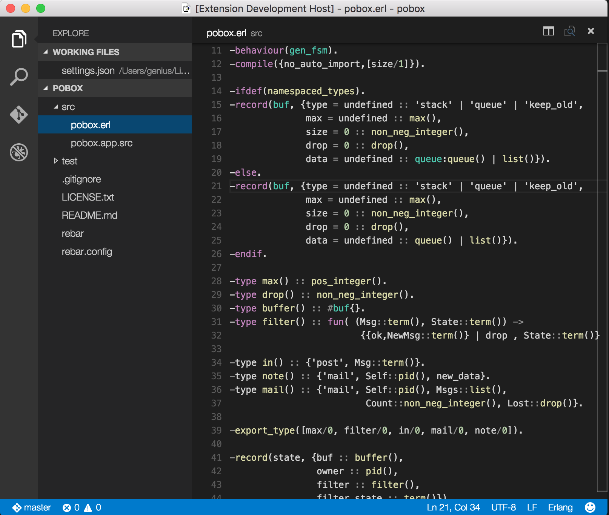

# Erlang for Visual Studio Code
This extension adds support for the Erlang language to VS Code, including:

## Colorization

## Build

- only rebar is supported

## Build arguments

- by default "compile" is used on build command
- You can override defaults arguments in configuration file (i.e: workspace settings) 

## Available commands

## Debug

- Variables list is automatically refresh from the current scope
- The process list contains an additional process for communication with vscode
- Function Breakpoints are supported: use format module:function/arity

## Debug arguments  

- you can provide a specific command line to 'erl' in launch.json configuration file.

## Run build before debugging
-  Add to launch.json file the entry "preLaunchTask": "rebar3 compile"
- Then first time you start debugging you need to:
   1. Select **Configure Task** in the alert, choose **Create tasks.json file from template** and then **Others: Example to run an arbitrary command**
   1. This will create tasks.json for you. Change both label and command to "rebar3 compile".
   1. Add entry "problemMatcher": "$erlang"

Then before each start debugging modified files will be recompiled automatically.

## Credits
File 'Erlang.tmLanguage' is inspired from https://github.com/textmate/erlang.tmbundle/blob/master/Syntaxes/Erlang.plist
