# Erlang for Visual Studio Code

[](https://marketplace.visualstudio.com/items?itemName=pgourlain.erlang)
[](https://marketplace.visualstudio.com/items?itemName=pgourlain.erlang)
[](https://github.com/pgourlain/vscode_erlang/actions?query=workflow:pr-verify)
[](https://github.com/pgourlain/vscode_erlang/blob/master/LICENSE)

This extension adds support for the Erlang language to Visual Studio Code, including editing, building and debugging.

New to the extension? Open **Help > Welcome > Get started with Erlang**: a walkthrough that checks your Erlang/OTP and rebar3 installation, then builds, tests and debugs your project.

## Features at a glance

| Area | Features |
|---|---|
| Editing | Completion with snippets, hover docs, signature help, inlay hints, CodeLens, diagnostics while typing |
| Highlighting | TextMate grammar + semantic highlighting from the syntax tree |
| Navigation | Definition, declaration, type definition, implementations, references, document/workspace symbols, call & type hierarchy, highlight occurrences, links in `-include` |
| Code actions | Quick fixes from compiler diagnostics, export/unexport, generate `-spec`, implement behaviour callbacks, extract function, inline variable, `if` ↔ `case`, sort `-export` |
| Formatting | Document, selection and on-type formatting (erlfmt), folding, expand/shrink selection, rename |
| Testing | EUnit and Common Test in the Testing view: run, debug, coverage |
| Build | rebar3 commands, rebar3 tasks (compile, eunit, ct, dialyzer, release, shell, clean), Dialyzer warnings in Problems with PLT status in the status bar |
| Debugger | Launch or attach to a running node; line, function, conditional, hit-count breakpoints, logpoints; variables, call stack, inline values |
| Status | Language server state and OTP version in the status bar |


## Editing support

- Syntax highlighting
- Automatic indentation
- Erlang IntelliSense
- Shows errors and warnings dynamically while you type
- Go To Definition/Peek Definition
- Hover help for standard functions
- Hover for project functions showing head clauses
- CodeLens showing exported functions and references
- InlayHints showing parameters name in function calls
  - disable by default : enable in configuration settings
  - limits : only works with locals calls

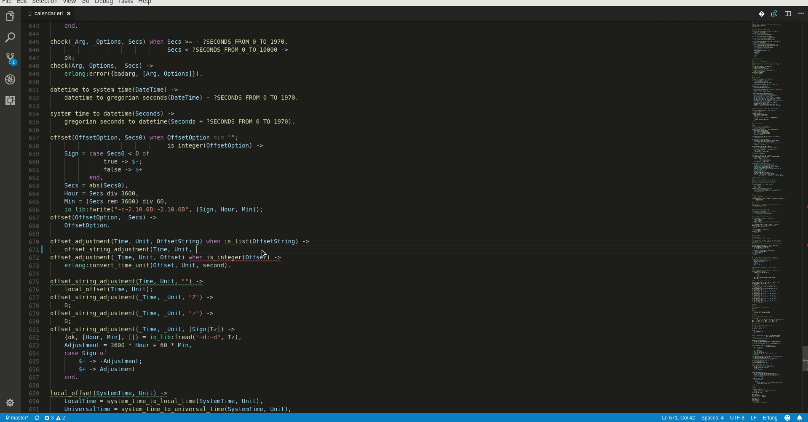

InlayHints in function calls

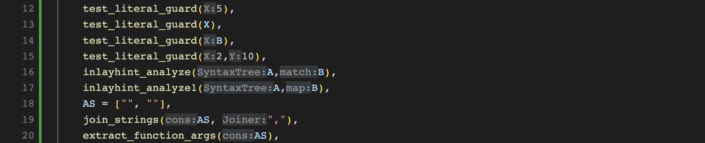
- showing parameter name when it doesn't match with caller var name

### Semantic highlighting

Modules, functions, macros, variables, parameters, types, records and record fields are colored from the real syntax tree, on top of the TextMate grammar. OTP modules are flagged as `defaultLibrary` and functions listed in `-deprecated` as `deprecated`.

- disable with `erlang.semanticTokensEnabled`

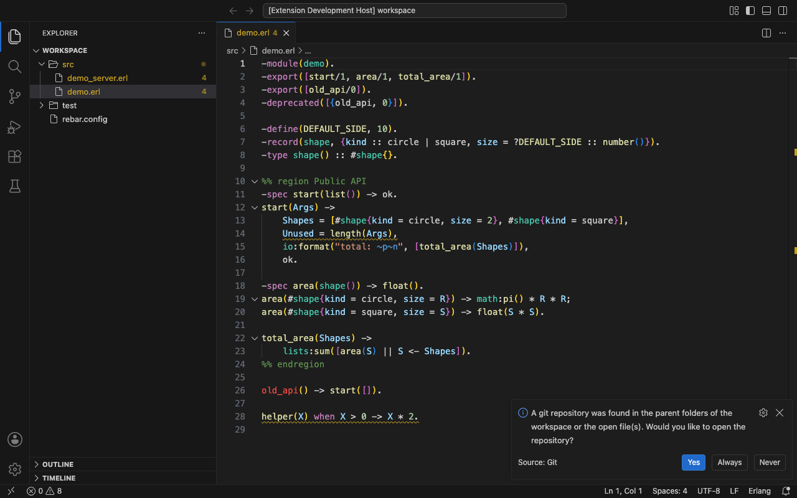

### Quick fixes and refactorings

Press `Ctrl+.` / `Cmd+.` on a diagnostic or on a selection:

- Quick fixes driven by compiler warnings/errors:
  - Prefix unused variable with `_`
  - Export an unused function
  - Create a stub for an undefined function
  - Add a missing field to a record definition
  - Remove include of a missing file
  - Add missing `-module(...)`
- Export / unexport a function, generate `-spec` from the function clauses
- Implement missing callbacks for a `-behaviour(...)`
- Refactorings: extract function from selection, inline variable, convert `if` ↔ `case`
- Source actions: sort the `-export` list

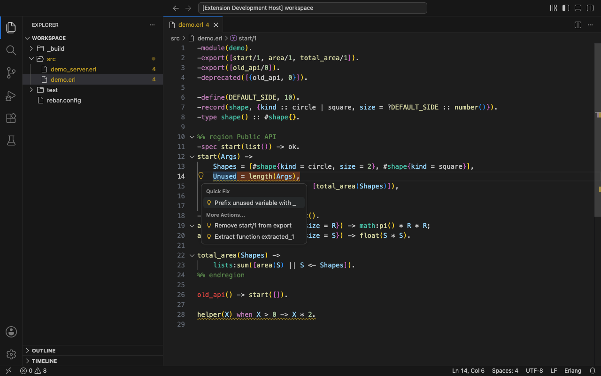

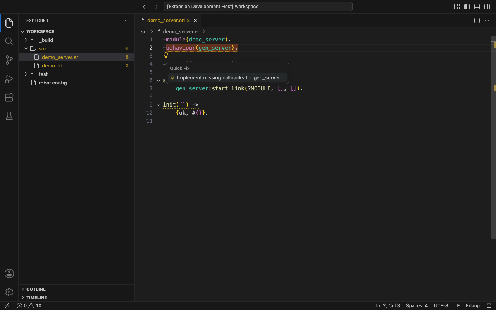

### Navigation

- Go to Symbol in Workspace (`Ctrl+T` / `Cmd+T`): functions, records, types, macros across the project
- Go to Declaration, Go to Type Definition (from a `-spec`/type usage to its `-type`/`-opaque`)
- Go to Implementations: from a `-callback` to every module implementing the behaviour
- Call Hierarchy (incoming/outgoing calls) and Type Hierarchy (behaviour ↔ implementors)
- Highlight all occurrences of the variable/function/record under the cursor
- Clickable `-include` / `-include_lib` paths and URLs in comments

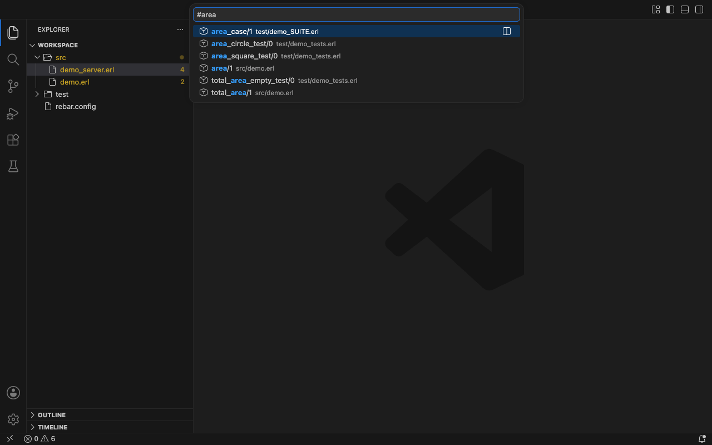

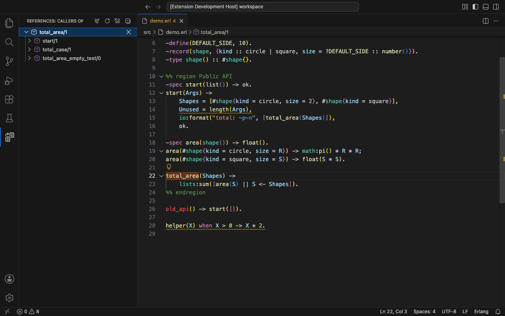

### Formatting and folding

- Format document, format selection and format on type (`.`, `;`, `,`, newline), powered by erlfmt
  - disable with `erlang.formatterEnabled`, line length with `erlang.formattingLineLength`
- Folding of functions, clauses, `case`/`receive`/`try`, `-export` lists, comment blocks and `%% region` / `%% endregion` markers
- Expand/shrink selection (`Shift+Alt+→` / `Shift+Alt+←`)
- Completion with snippets for function arguments, `?` for macros, `-` for attributes

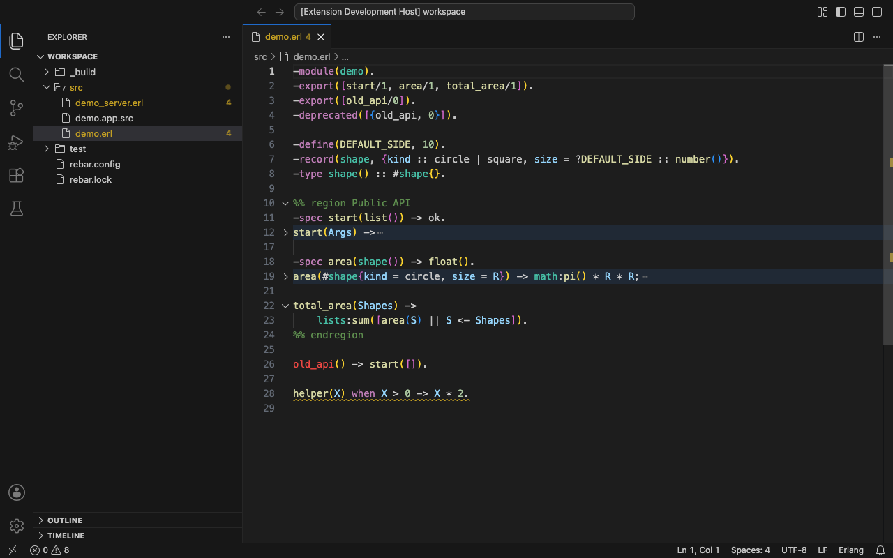

## Testing

EUnit and Common Test tests are discovered by the language server and shown in the VS Code **Testing** sidebar:

- EUnit: `*_test/0`, `*_test_/0` functions (including inside `-ifdef(TEST)`)
- Common Test: `*_SUITE.erl` modules and their test cases
- Run, Debug (breakpoints in tests) and Run with Coverage profiles
- Per-test results with failure message and location, line coverage of the code under test shown in the editor gutter

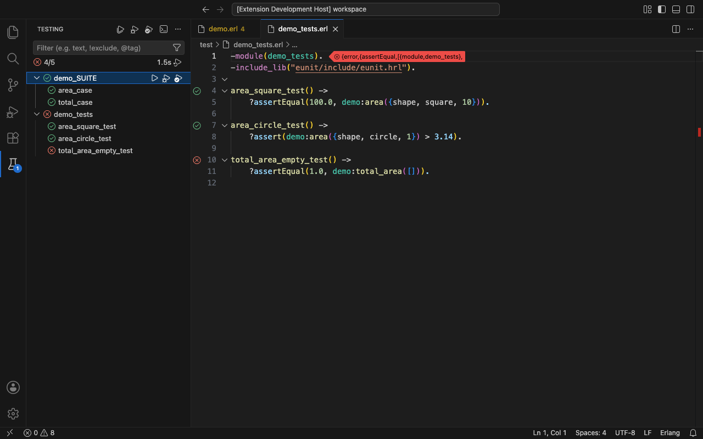

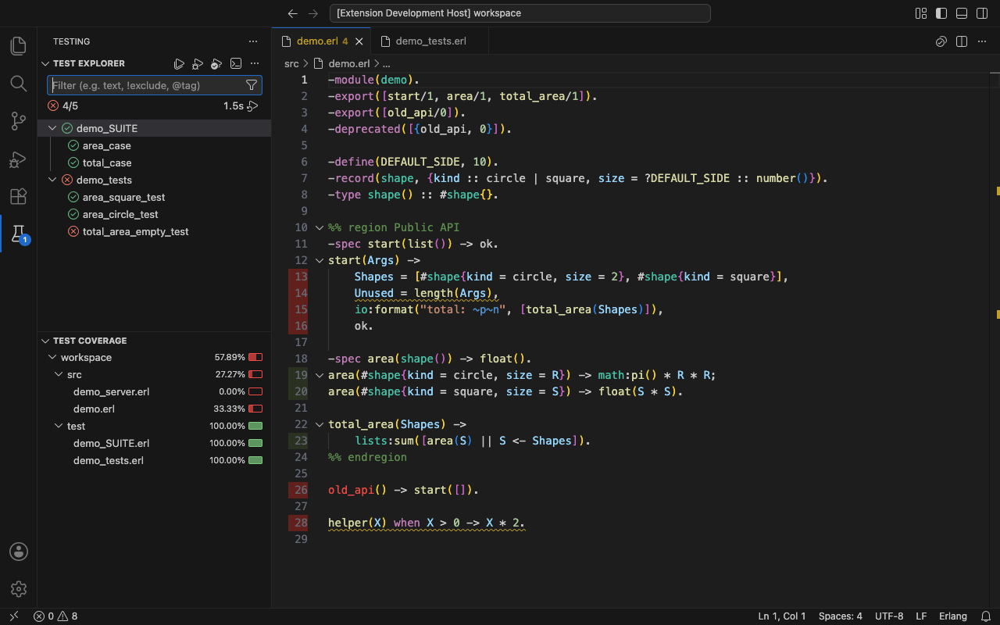

## Build

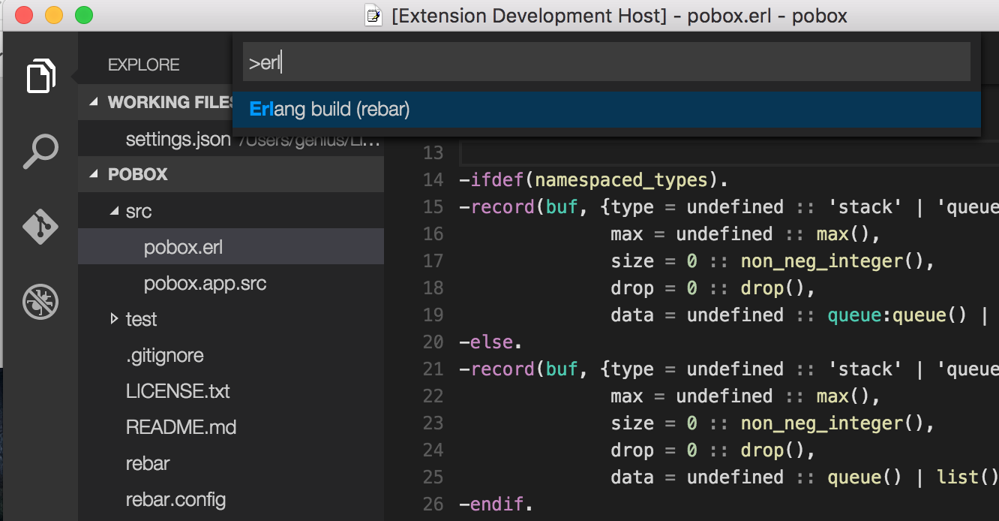

- Standard rebar3 is the default build tool, also rebar is supported. The rebar.config file should be placed in the root directory.
- Build arguments are configurable, by default "compile" is used
- You can override the default in configuration file (i.e. workspace settings)

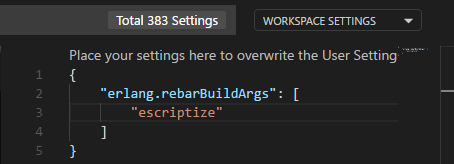

### rebar3 tasks

For every workspace folder with a `rebar.config`, **Terminal > Run Task > rebar3** offers `compile` (the default build task), `eunit` and `ct` (test tasks), `dialyzer`, `shell`, `clean`, and `release` when `relx` is configured. Compiler errors and dialyzer warnings land in the Problems panel (`$rebar3` and `$rebar3-dialyzer` problem matchers).

Customize them in `tasks.json`:

```json
{
    "type": "rebar3",
    "command": "ct",
    "profile": "test",
    "args": ["--suite", "apps/myapp/test/myapp_SUITE"],
    "problemMatcher": ["$rebar3"]
}
```

### Dialyzer

`Erlang: rebar dialyzer` shows its warnings in the Problems panel. The status bar shows the state of the project PLT: `none` (the first run builds it, which is slow), `stale` (`rebar.lock` or `rebar.config` changed since it was built; rebar3 updates it incrementally on the next run) or `ready`. Click it to run dialyzer.

## Debugger

- Variables List shows variables from the current scope
- Call Stack shows Erlang processes and allows to control them with e.g. Pause and Continue
- Standard commands Step Over, Step Into, Step Out supported
- Full breakpoints support:
  - Regular breakpoints
  - Function Breakpoints: use format module:function/arity
  - Conditional Breakpoints
  - Hit-Count Breakpoints

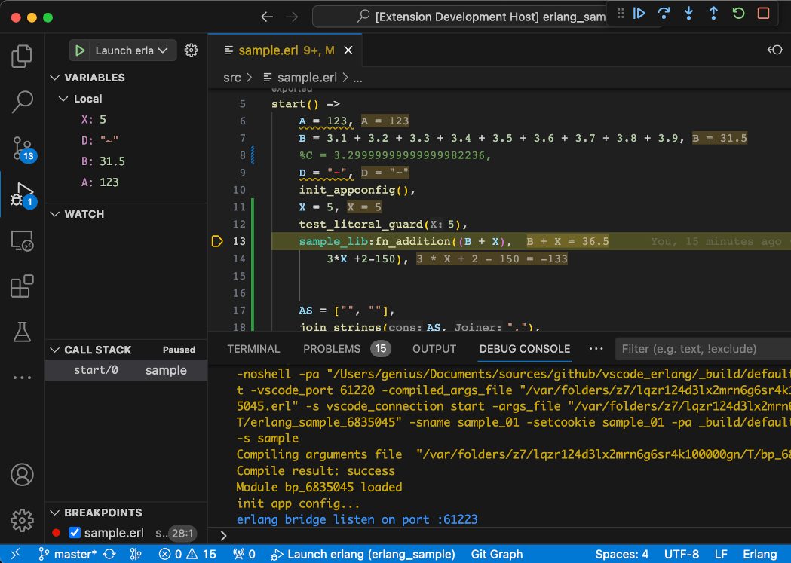

## Running debugger

You can provide a specific command line to 'erl' in launch.json configuration file in "arguments" entry.

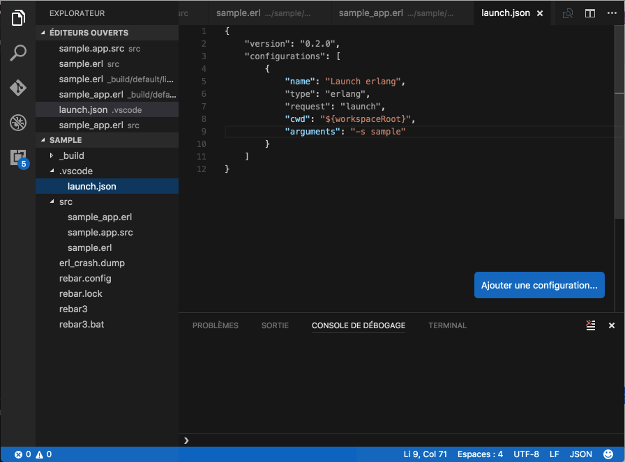

The modified code may be automatically build before debugger is started: add `"preLaunchTask": "rebar3: compile"` to the launch configuration. Then, before debugging is started, modified files will be recompiled automatically.

`"erlpath": "${command:erlpath}"` uses the `erl` from `erlang.erlangPath` (or the `PATH`). **Add Configuration...** in launch.json offers ready-made snippets.

### Attach to a running node

```json
{
    "name": "Attach to myapp",
    "type": "erlang",
    "request": "attach",
    "node": "myapp@localhost",
    "cwd": "${workspaceFolder}"
}
```

The debugger starts a hidden helper node, connects to `node`, loads its bridge there and interprets the project's modules, so breakpoints work in the running system. Disconnecting removes every breakpoint, releases the processes stopped at one and stops interpreting; the node keeps running (use **Terminate** to stop it instead).

- The node must run on the same machine, as a distributed node (`-sname`/`-name`), with the `debugger` and `inets` applications available (a release must include them).
- Cookie: `~/.erlang.cookie` by default, or a `"cookie"` entry.
- Project modules must be compiled with `debug_info` (rebar3 default).

## Using this extension in Erlang Docker instance

Clone this repo, and try it :
- [vscode-remote-try-erlang](https://github.com/pgourlain/vscode-remote-try-erlang)

For more information about vscode and containers :
- [setup vscode for containers](https://code.visualstudio.com/docs/containers/overview) and [remote container documentation](https://code.visualstudio.com/docs/remote/containers)

## Available commands

Support for Erlang tools, including rebar3, EUnit and Dialyzer

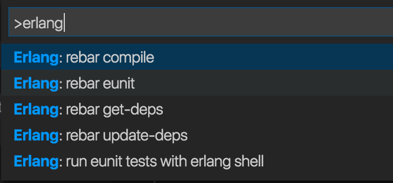

- Dialyzer warnings displayed in Problems tab for easy navigation
- `Erlang: Check Erlang/OTP and rebar3 installation` - which erl and rebar3 the extension uses
- `Erlang: Show Language Server Output`, `Erlang: Restart Language Server`

The status bar shows the language server state (starting, ready with the OTP version, failed). A start failure is reported with a notification; click the item to open the output.

## Editor defaults

For Erlang files the extension sets 4-space indentation (erlfmt's), enables semantic highlighting and keeps format-on-save off. Override them under `"[erlang]"` in your settings. Double-click selects whole Erlang words: `node@host` atoms, `'quoted atoms'`, `16#FF` numbers.

## Settings

- `erlang.erlangPath` - Directory location of erl/escript
- `erlang.erlangArgs` - Arguments passed to Erlang backend
- `erlang.erlangDistributedNode` - Start the Erlang backend in a distributed Erlang node for extension development
- `erlang.rebarPath` - Directory location of rebar/rebar3
- `erlang.rebarBuildArgs` - Arguments to provide to rebar/rebar3 build command
- `erlang.includePaths` - Include paths are read from rebar.config, and also standard set of paths is used. This setting is for special cases when the default behaviour is not enough
- `erlang.linting` - Enable/disable dynamic validation of opened Erlang source files
- `erlang.codeLensEnabled` - Enable/Disable CodeLens
- `erlang.cacheManagement` - Specify where and how to store large cache tables
- `erlang.inlayHintsEnabled` - Enable/Disable InlayHints
- `erlang.semanticTokensEnabled` - Enable/Disable semantic highlighting
- `erlang.formatterEnabled` - Enable/Disable the formatter (document, selection and on-type)
- `erlang.formattingLineLength` - Maximum line length for formatting
- `erlang.verbose` - Activate technical traces for use in the extension development
- `erlang.verboseExcludeFilter` - LSP methods excluded from technical traces
- `erlang.debuggerRunMode` - How the debug adapter is run (`external`, `server`, `inline`)
- `erlang.useShell` - Whether erl/escript/erlc are spawned through a shell (`auto`: Windows only, `always`, `never`)

## Help

Something not working? [Help & Troubleshooting](./HELP.MD) lists the usual symptoms - `erl` not found, the language server not starting, false include errors, breakpoints never hit, memory usage on large projects - with their fixes.

## Credits

File 'Erlang.tmLanguage' is inspired from <https://github.com/textmate/erlang.tmbundle/blob/master/Syntaxes/Erlang.plist>
