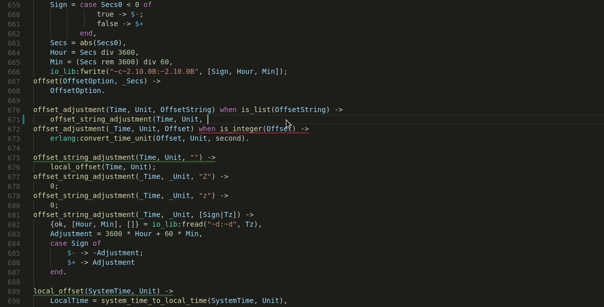
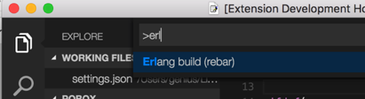
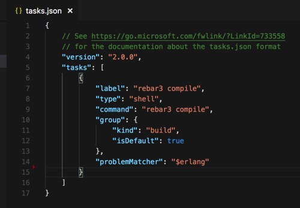

# Erlang for Visual Studio Code

This extension adds support for the Erlang language to Visual Studio Code, including editing, building and debugging.

## Editing support

- Syntax highlighting
- Automatic indentation
- Erlang IntelliSense
- Shows errors and warnings dynamically while you type
- Go To Definition/Peek Definition
- Hover help for standard functions
- Hover for project functions showing head clauses
- CodeLens showing exported functions and references

## Build

- Standard rebar3 is the default build tool, also rebar is supported. The rebar.config file should be placed in the root directory.
- Build arguments are configurable, by default "compile" is used
- You can override the default in configuration file (i.e. workspace settings)

## Debugger

- Variables List shows variables from the current scope
- Call Stack shows Erlang processes and allows to control them with e.g. Pause and Continue
- Standard commands Step Over, Step Into, Step Out supported
- Full breakpoints support:
  - Regular breakpoints
  - Function Breakpoints: use format module:function/arity
  - Conditional Breakpoints
  - Hit-Count Breakpoints

## Running debugger

You can provide a specific command line to 'erl' in launch.json configuration file in "arguments" entry.

The modified code may be automatically build before debugger is started. To set automatic build up you need to:

1. Add to launch.json file the entry "preLaunchTask": "rebar3 compile"
1. Select **Configure Task** in the alert, choose **Create tasks.json file from template** and then **Others: Example to run an arbitrary command**
1. This will create tasks.json for you. Change both label and command to "rebar3 compile".
1. Add entry "problemMatcher": "$erlang"

Then, before debugging is started, modified files will be recompiled automatically.

## Available commands

Support for Erlang tools, including rebar3, EUnit and Dialyzer

- Dialyzer warnings displayed in Problems tab for easy navigation

## Settings

- `erlang.erlangPath` - Directory location of erl/escript
- `erlang.rebarPath` - Directory location of rebar/rebar3
- `erlang.rebarBuildArgs` - Arguments to provide to rebar/rebar3 build command
- `erlang.includePaths` - Include paths are read from rebar.config, and also standard set of paths is used. This setting is for special cases when the default behaviour is not enough
- `erlang.linting` - Enable/disable dynamic validation of opened Erlang source files
- `erlang.codeLensEnabled` - Enable/Disable CodeLens
- `erlang.verbose` - Activate technical traces for use in the extension development

## Help

[Some configuration tricks](./HELP.MD)

## Credits

File 'Erlang.tmLanguage' is inspired from <https://github.com/textmate/erlang.tmbundle/blob/master/Syntaxes/Erlang.plist>
