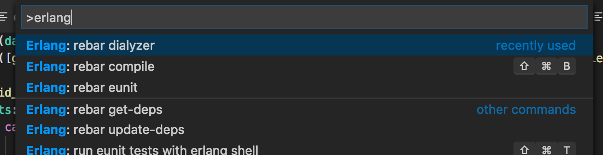
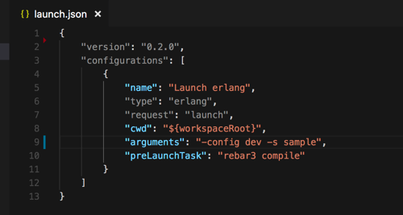

# Erlang for Visual Studio Code
This extension adds support for the Erlang language to VS Code, including:

## Colorization

## Build

- only rebar is supported

## Build arguments

- by default "compile" is used on build command
- You can override defaults arguments in configuration file (i.e: workspace settings) 

## Available commands

## Debug

- Variables list is automatically refresh from the current scope
- The process list contains an additional process for communication with vscode

## Debug arguments  

- you can provide a specific command line to 'erl' in launch.json configuration file.

## Credits
File 'Erlang.tmLanguage' is inspired from https://github.com/textmate/erlang.tmbundle/blob/master/Syntaxes/Erlang.plist
